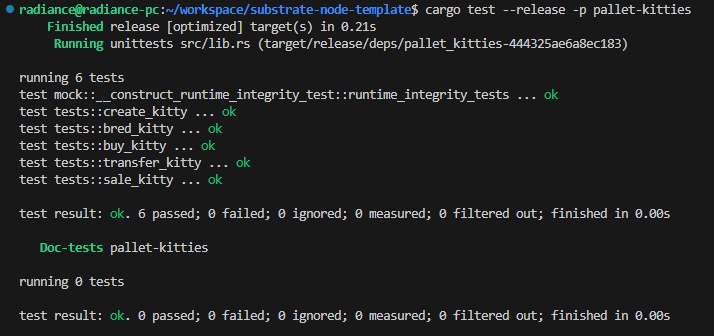
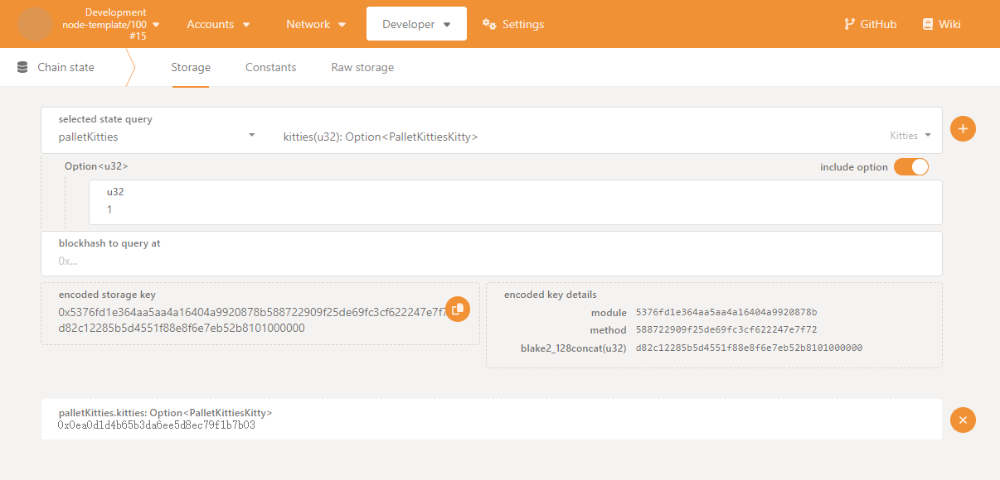
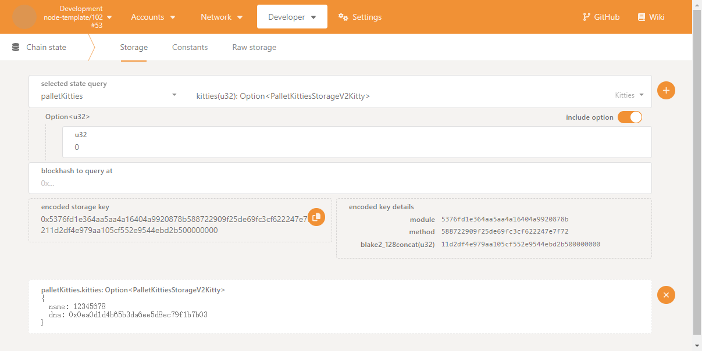
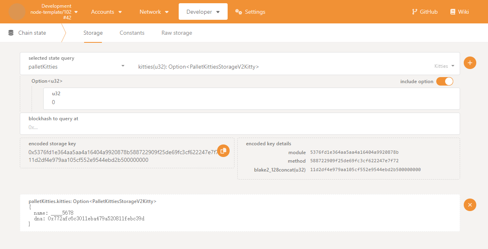
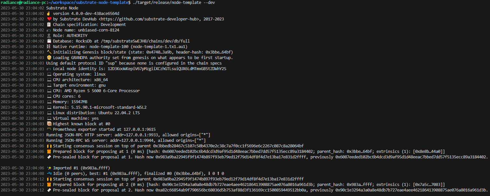
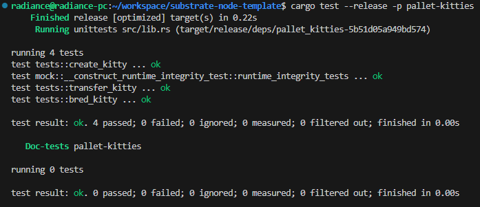
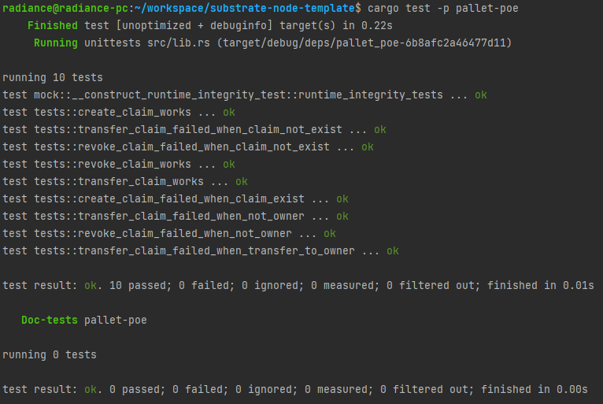

# Kitties 教程(二)

## 单元测试

## V0 升级到 V2

## 重置链， V0 升级到 V1，再升级到 V2

# Kitties 教程(一)

## Kitties加入到Runtime，Node正常启动

## 单元测试

# Proof of existence

## 单元测试

### create_claim_works
创建存证成功

### create_claim_failed_when_claim_exist
创建存证失败，因为存证已存在

### revoke_claim_works
撤销存证成功

### revoke_claim_failed_when_claim_not_exist
撤销存证失败，因为存证不存在

### revoke_claim_failed_when_not_owner
撤销存证失败，因为不是存证的所有者

### transfer_claim_works
转移存证成功

### transfer_claim_failed_when_claim_not_exist
转移存证失败，因为存证不存在

### transfer_claim_failed_when_not_owner
转移存证失败，因为不是存证的所有者

### transfer_claim_failed_when_transfer_to_owner
转移存证失败，因为转移给自己
