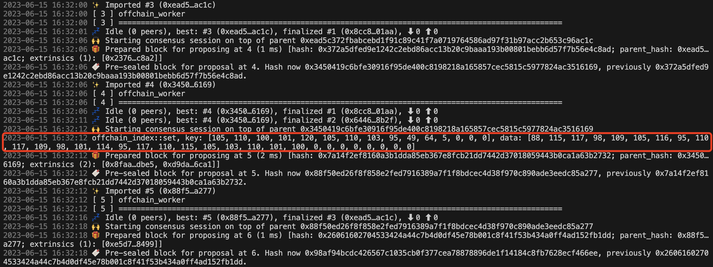
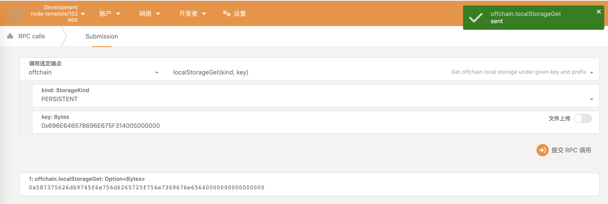
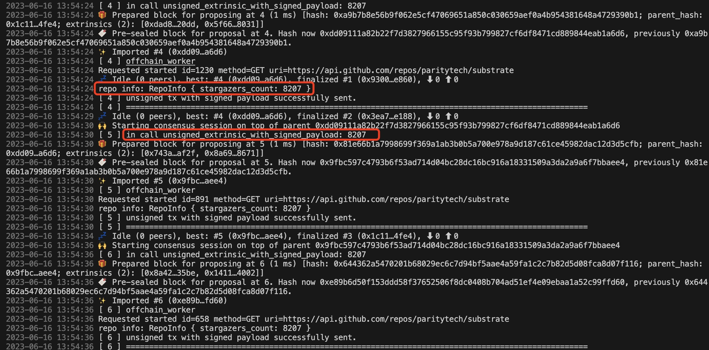
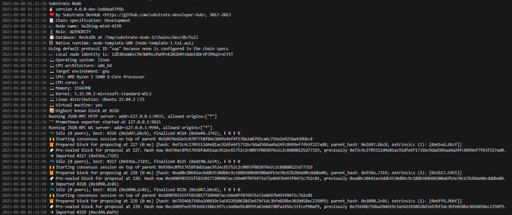

# Offchain Worker

## 链上随机数与链下随机数的区别

### 链上随机数
在区块链网络中生成的随机数，是链上数据的一部分，每个节点会生成相同的随机数，由共识机制来验证

### 链下随机数
在链下环境中生成的随机数，不受链上共识机制的限制，可以根据节点自身的状态、时间戳等计算生成，也可以由外部源提供

## Offchain indexing

### 写入数据，节点打印日志

### Key
[105, 110, 100, 101, 120, 105, 110, 103, 95, 49, 64, 5, 0, 0, 0]
### Key 转成16进制
0x696E646578696E675F314005000000

### Data
[88, 115, 117, 98, 109, 105, 116, 95, 110, 117, 109, 98, 101, 114, 95, 117, 110, 115, 105, 103, 110, 101, 100, 0, 0, 0, 0, 0, 0, 0, 0]

### Data 转成16进制
0x587375626d69745f6e756d6265725f756e7369676e65640000000000000000

### localStorageGet

## unsigned_extrinsic_with_signed_payload

从 https://api.github.com/repos/paritytech/substrate 获取 substrate 项目的 star 数，并通过带签名负载的不签名交易提交到链上

# Kitties 教程(二)

## Node正常启动

## 单元测试

## V0 升级到 V2

## 重置链， V0 升级到 V1，再升级到 V2

# Kitties 教程(一)

## Kitties加入到Runtime，Node正常启动

## 单元测试

# Proof of existence

## 单元测试

### create_claim_works
创建存证成功

### create_claim_failed_when_claim_exist
创建存证失败，因为存证已存在

### revoke_claim_works
撤销存证成功

### revoke_claim_failed_when_claim_not_exist
撤销存证失败，因为存证不存在

### revoke_claim_failed_when_not_owner
撤销存证失败，因为不是存证的所有者

### transfer_claim_works
转移存证成功

### transfer_claim_failed_when_claim_not_exist
转移存证失败，因为存证不存在

### transfer_claim_failed_when_not_owner
转移存证失败，因为不是存证的所有者

### transfer_claim_failed_when_transfer_to_owner
转移存证失败，因为转移给自己
